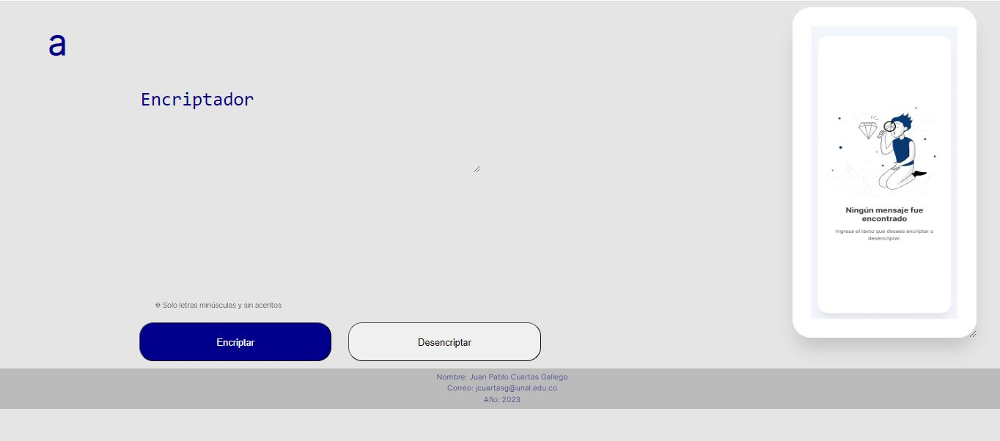
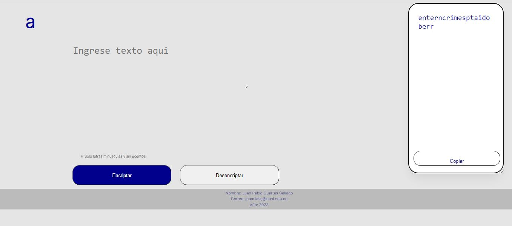

# Encryptor - Challenge #1 of the Oracle Next Education program.

## Table of contents

- [Overview](#overview)
  - [The challenge](#the-challenge)
  - [Screenshot](#screenshot)
- [My process](#my-process)
  - [Built with](#built-with)
  - [What I learned](#what-i-learned)
- [Author](#author)

## Overview

### The challenge

Building a text encryptor based on a Figma design using HTML5, CSS3, and vanilla JavaScript.

- The encryptor should have a text field and a button that allows me to encrypt the text.
- There will be another button in case I want to decrypt a text.
- The design should follow a model provided by a Figma design.

### Screenshot

## My process

### Built with

- Vanilla JavaScript
- HTML5
- CSS3

### What I learned

I learned how to create more dynamic applications using HTML5, CSS3, and JavaScript. I also learned a bit about responsive design to adapt my application to different types of devices..

## Author

- LinkedIn - [Juan Pablo Cuartas](https://www.your-site.com)
- Email - [juanpa88842@gmail.com](https://www.linkedin.com/in/juanpablocuartas/)

